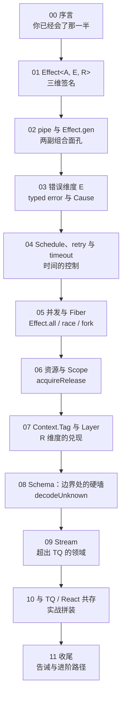

## 学习路径

## 前置要求

- 熟悉 TanStack Query（`useQuery`、`queryFn`、`staleTime`、`refetch`）
- 熟悉 TypeScript 泛型基础（知道 `T extends X` 是什么意思）

## 索引

| 章节 | 核心签名 / 概念 |
|------|----------------|
| [00 序言](00-prelude) | TQ → Effect 思路连续性 |
| [01 三维签名](01-effect-aer) | `Effect<A, E, R>` |
| [02 组合](02-pipe-and-gen) | `pipe` / `Effect.gen + yield*` |
| [03 错误维度](03-error-channel) | `catchTag` / `Cause` |
| [04 调度重试](04-schedule-retry) | `Schedule` / `retry` / `timeout` |
| [05 并发 Fiber](05-fiber-concurrency) | `Effect.all` / `race` / `fork` |
| [06 资源 Scope](06-resource-scope) | `acquireRelease` / `Scope` |
| [07 依赖注入](07-context-layer) | `Context.Tag` / `Layer` |
| [08 Schema 边界](08-schema-boundary) | `Schema.Struct` / `decodeUnknown` |
| [09 Stream](09-stream) | `Stream<A, E, R>` |
| [10 React 共存](10-react-coexistence) | `runPromise` in `queryFn` / `@effect-rx` |
| [11 收尾](11-coda) | API 漂移告诫 / 进阶路径 |
| [速查表](cheatsheet) | 常用签名一览（可喂给 agent） |
